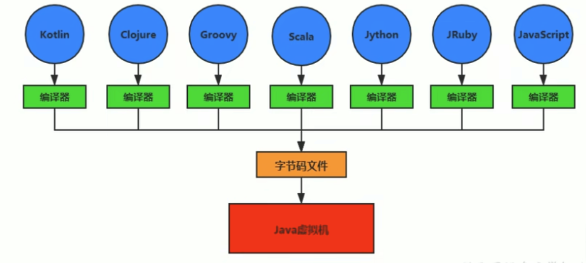

# JVM與Java體系結構

Java：跨平台的語言
------------------


*Write once, run anywhere.*

JVM：跨語言的平台
-----------------



* Java虛擬機的設計者們通過JSR-292規範基本實現在**Java虛擬機平台上運行非Java語言編寫的代碼**。
* Java虛擬機根本不關心運行在其內部的程序到底是使用什麼語言編寫的，**他只關心"字節碼"文件**。也就是說java虛擬機擁有語言無關性，並不會單純與Java語言終身綁定，只要其他編程語言的編譯結果滿足並包含Java虛擬機的內部指令集、符號表以及其他的輔助信息，他就是一個有效的字節碼文件，能夠被虛擬機識別和運行。

**Java不是最強大的語言，但是JVM是最強大的虛擬機**

字節碼
------

* 我們平時說的Java字節碼，指的是用Java語言編譯成的字節碼。準確的說任何能在JVM平台上執行的字節碼格式都是一樣的。所以應該統稱為：**JVM字節碼**。
* 不同的編譯器，可以編譯出相同的字節碼文件，字節碼文件也可以在不同的JVM上運行。
* Java虛擬機與Java語言並沒有必然的關係，他只與特定的二進制文件格式-`.class`文件格式所關聯，`.class`文件中包含了Java虛擬機指令集(稱為字節碼、Bytecodes)和符號表，還有一些其他輔助信息。

多語言混合編程
--------------

Java平台上的多語言混合編程正成為主流，通過特定領域的語言去解決特定領域的問題是當前軟件開發應對日趨複雜的項目需求的一個方向。

試想一下，在一個項目中，并行處理用Clojure語言編寫，展示層用JRuby/Rails，中間層用Java，每個應用層都將使用不同的編程語言來完成，而且接口對每一層的開發者都是透明的，**各種語言之間的交互不存在任何困難，就像使用自己語言的原生API一樣方便，因為他們最終都運行在一個虛擬機之上**。

對這些運行於Java虛擬機之上、Java之外的語言來自系統級的、底層的支持正在迅速增強，以JSR-292為和新的一系列項目和功能改進，**推動Java虛擬機從"Java語言的虛擬機"向"多語言虛擬機"的方向發展**。

Open JDK和Oracle JDK
--------------------


JDK11之前OracleJDK還存在一些OpenJDK中沒有的、閉源的功能。但在JDK11中，我們可以認為OpenJDK和OracleJDK代碼實質上已經完全一致。

虛擬機
------

* 所謂虛擬機(Virtual Machine)，就是一台虛擬的計算機。他是一款軟件，用來執行一系列虛擬計算機指令。大體上，虛擬機可以分為**系統虛擬機**和**程序虛擬機**。
  * Visual Box, WMware就屬於系統虛擬機，他們完全是**對物理計算機的仿真**，提供了一個可運行完整操作系統的軟件平台。
  * Java虛擬機是一種程序虛擬機，他**專門為執行單個計算機程序而設計**，在Java虛擬機中執行的指令我們稱為Java字節碼指令。
* 無論是系統虛擬機還是程序虛擬機，在上面運行的軟件都被限制於虛擬機提供的資源中。

**Java虛擬機**：

* Java虛擬機是一台執行Java字節碼的虛擬計算機，它擁有獨立的運行機制，其運行的Java字節碼也未必由Java語言編譯而成。
* JVM平台的各種語言可以共享Java虛擬機帶來的跨平台性、優秀的垃圾回收器，以及可靠的即時編譯器。
* **Java技術的核心就是Java虛擬機(JVM)**，因為所有的Java程序都運行在Java虛擬機內部。
* 作用：**Java虛擬機就是二進制字節碼的運行環境**，負責裝載字節碼到其內部，解釋/編譯為對應平台商的機器指令執行。每一條Java指令，Java虛擬機規範中都有詳細定義，如怎麼操作數，怎麼處理操作數，處理結果放在哪裡。
* 特點：
  * 一次編譯，到處運行
  * 自動內存管理
  * 自動垃圾回收功能

JVM的位置
---------


JVM是運行在操作系統之上的，他與硬件沒有直接的交互。


**`.java`使用前端編譯器 `javac`編譯成 `.class`，解釋運行涉及到後端編譯器(JVM層面的內容，Java HotSpot Client and Server VM)**。

JVM整體結構
-----------


💡 方法區、堆是**每個線程共有的**。
💡 虛擬機棧(Java棧)、本地方法棧、程序計數器是**每個線程都有一份的(私有的)**。

* HotSpot VM是目前市面上高性能虛擬機的代表作之一(OpenJDK和OracleJDK公用的虛擬機)。
* 它採用解釋器與即時編譯器並存的架構。
* 執行引擎：負責**翻譯成機器語言(0101..)**。

Java代碼執行流程
----------------


JVM的架構模型
-------------

Java編譯器輸入的指令流基本上是一種基於**棧的指令集架構**，另一種指令集架構則是基於**寄存器的指令集架構**。

棧式架構的特點：

* 設計和實現更簡單，適用於資源受限的系統。
* 避開了寄存器的分配難題。使用零地址指令方式分配。
* 指令流中的指令大部分是零地址指令，其執行過程依賴於操作棧。指令集更小，編譯器容易實現。
* 不需要硬件支持，可移植性更好，更好實現跨平台。
* 舉例：(8個指令集)
  ```
  iconst_2 //常量2入棧
  istore_1
  iconst_3 // 常量3入棧
  istore_2
  iload_1
  iload_2
  iadd //常量2/3出棧
  istore_0 // 结果5入棧
  ```

寄存器架構的特點：

* 典型的應用是x86的二進制指令集：比如傳統的PC以及Android的Davlik虛擬機。
* **指令集架構則完全依賴硬件，可移植性差**。
* **性能優秀和執行更高效**。
* 花費更少的指令去完成一項操作。
* 大部分情況，基於寄存器架構的指令集往往都以一地址指令、二地址指令和三地址指令為主，而基於棧式架構的指令集是以零地址指令為主。
* 舉例：
  ```
  mov eax,2 //將eax寄存器的值設為1
  add eax,3 //使eax寄存器的值加3
  ```

案例：運行[StackStructureTest.java](StackStructureTest.java) 後，到target目錄，使用命令 `javap -v StackStructureTest`可以看到對應的字節碼指令。

總結：

* 由於跨平台性的設計，Java的指令都是根據棧來設計的。不同平台CPU架構不同，所以不能設計為基於寄存器的。優點是跨平台、指令集小，編譯容易實現，缺點是性能下降，實現同樣的功能需要更多的指令。
* **棧：跨平台性、指令集小、指令多。執行性能比寄存器差**。

JVM的生命週期
-------------

**虛擬機的啟動**：Java虛擬機的啟動是通過引導類加載器(bootstrap class loader)創建一個初始類(initial class)來完成的，這個類是由虛擬機的具體實現指定的。

**虛擬機的運行**：

* 一個運行中的Java虛擬機有著一個清晰的任務：執行Java程序。
* 程序開始執行他才運行，程序結束時他就停止。
* **執行一個所謂的Java程序的時候，真真正正在執行的是一個叫做Java虛擬機的進程**。(可以使用 `jps`命令查看當前執行中的進程)

**虛擬機的結束**(有如下的幾種情況)：

* 程序正常結束。
* 程序在執行過程中遇到了異常或錯誤而異常終止。
* 由於操作系統出現錯誤而導致Java虛擬機進程終止。
* 某線程調用 `System`的 `exit()`方法，或 `Runtime`類的 `halt()`方法，並且Java安全管理器也允許這次exit或halt的操作。
* 除此之外，JNI規範描述了用JNI Invocation API來加載或卸載Java虛擬機時，Java虛擬機得退出情況。

JVM發展歷程
-----------

**具體JVM的內存結構，其實取決於其實現，不同廠商的JVM，或者同一廠商發布的不同版本，都有可能存在一定差異**。

*Sun Classic VM*

* 早在1996年Java1.0時Sun公司發布了一款名為Sun Classic VM的Java虛擬機，他同時也是世界上**第一款商用Java虛擬機**，JDK1.4時完全被淘汰。
* **這款虛擬機內部只提供解釋器**。(沒有JIT即時編譯器，不能找熱點代碼並緩存起來，執行效率比較差，執行字節碼指令時需要逐行解釋，即時有些重複性的代碼 ex.`for`循環)
* 如果需要使用JIT編譯器，就需要進行外掛。但是一但使用了JIT編譯器，JIT就會接管虛擬機的執行系統。解釋器就不再工作。解釋器和編譯器不能配合工作。
* 現在Hotspot內置了此虛擬機。

*Exact VM*

* 為了解決上一個虛擬機的問題，JDK1.2時，SUN提供了此虛擬機。
* Exact Memory Management：準確式內存管理。
  * 也可以叫Non-Conservative/Accurate Memory Management。
  * **虛擬機可以知道內存中某個位置的具體類型是什麼**。
* 具備現代高性能虛擬機的雛形
  * 熱點探測。
  * 編譯器與解釋器混合工作模式。
* 只在Solaris平台(Sun自己的平台)短暫使用，其他平台還是Classic VM。最終被Hotspot虛擬機替換。

***HotSpot VM(重點)(三大虛擬機之一)***

* HotSpot歷史
  * 最初由一家名為"Longview Technologies"的小公司設計。
  * 1997年，此公司被Sun收購，2009年Sun公司被Oracle收購。
  * **JDK1.3時，HotSpot VM成為默認虛擬機**。
* 目前HotSpot佔有絕對的市場地位。
  * 目前主流java版本默認的虛擬機都是HotSpot。
  * **Sun/Oracle JDK和OpenJDK的默認虛擬機**。
  * 目前使用的虛擬機都是HotSpot，相關機制也主要是指HotSpot的GC機制。(比如前面兩個商用虛擬機都沒有方法區的概念)
* 從服務器、桌面到移動端、嵌入式都有應用。
* 名稱中的HotSpot指的就是他的**熱點代碼探測技術**。
  * 通過計數器找到最具編譯價值代碼(熱點代碼)，觸發即時編譯或棧上替換。
  * 通過編譯器與解釋器協同工作，在最優化的程序響應時間與最佳執行性能中取得平衡。

*JRockit(三大虛擬機之一)*

* **專注於服務器端應用**
  * 他可以不太關注程序啟動速度，因此**JRockit內部不包含解析器實現**，全部代碼都靠即時編譯器編譯後執行。
* 大量的行業基準測試顯示，JRockit JVM是世界上最快的JVM。
  * 使用JRockit產品，客戶已經體驗到了顯著的性能提高(一些超過了70%)和硬件成本的減少(打50%)。
* 優勢：全面的Java運行時解決方案組合。
  * JRockit面向延遲敏感型應用的解決方案JRockit Real Time提供以毫秒或微秒級的JVM響應時間，適合財務、軍事指揮、電信網路的需要。
  * MissionControl服務套件，他是一組以極低的開銷來監控、管理和分析生產環境中的應用程序的工具。
* 2008年JRockit被Oracle收購。
* Oracle表達了整合兩大優秀虛擬機的工作，大致在JDK1.8完成。整合的方式是在HotSpot的基礎上，移植JRockit的優秀特性。

*IBM的J9(三大虛擬機之一)*

* 全稱：IBM Technology for Java Virtual Machine，簡稱IT4J，內部代號：J9。
* 市場定位與HotSpot接近，服務器端、桌面應用、嵌入式等多用途VM。
* 廣泛用於IBM的各種Java產品。
* 目前，**最有影響力的三大商用虛擬機之一**，也號稱是世界上最快的Java虛擬機。
* 2017年左右，IBM發布了開源J9 VM，命名為OpenJ9，交給Eclipse基金會管理，也稱為Eclipse OpenJ9。
  * OpenJDK是JDK開源了，包括虛擬機。

*KVM和CDC/CLDC HotSpot*

* Oracle在Java ME產品線上的兩款虛擬機為：CDC/CLDC HotSpot Implementation VM。
* KVM(Kilobyte)是CLDC-HI早期產品。
* 目前移動領域地位尷尬，智能手機被Android和IOS二分天下。
* KVM簡單、輕量、、高度可移植，面向更低端的設備上還維持著自己的市場
  * 智能控制器、傳感器。
  * 老人手機
* 所有的虛擬機的原則：一次編譯，到處運行。

*Azul VM*

* 前面三大"高性能Java虛擬機"使用在**通用硬件平台**上。
* Azul VM和BEA Liquid VM是與**特定硬件平台綁定、軟硬件配合的專有虛擬機**。
* Azul VM是Azul Systems公司在HotSpot基礎上進行大量改進，運行於Azul Systems公司的專有硬件Vega系統上的Java虛擬機。
* **每個Azul VM實例都可以管理至少數十個CPU和數百GB內存的硬件資源，並提供在巨大內存範圍內實現可控的GC時間的垃圾收集器、專有硬件優化的線程調度等優秀特性**。
* 2010年，Azul Systems公司開始從硬件轉向軟件，發布了自己的Zong JVM，可以在通用x86平台上提供接近於Vega系統的特性。

*Liquid VM*

* BEA公司開發的，直接運行在自家Hypervisor系統上。
* Liquid VM即是現在的JRockit VE(Virtual Edition)，**Liquid VM不需要操作系統的支持，或者說他自己本身實現了一個專用操作系統的必要功能，如線程調度、文件系統、網路支持等**。
* 隨著JRockit虛擬機(原本是BEA公司的)終止開發，Liquid VM項目也停止了。

*Apache Harmony*

* Apache也曾經推出過與JDK1.5和JDK1.6兼容的Java運行平台Apache Harmony。
* 他是IBM和Intel聯合開發的開源JVM，受到同樣開源的OpenJDK的壓制，Sun堅決不讓Harmony獲得JCP認證，最終於2011年退役，IBM轉而參與OpenJDK。
* 雖然目前並沒有Apache Harmony被大規模商用的案例，但是他的Java類庫代碼被吸納進了Android SDK。

*Microsoft JVM*

* 微軟為了在IE3瀏覽器中支持Java Applets，開發了Microsoft JVM。
* 只能在windows平台下運行。但卻是當時Windows下性能最好的Java VM。
* 1997年Sun已侵犯商標、不正當競爭罪名指控微軟成功，賠了Sun很多錢。微軟在WindowsXP SP3中抹掉了其VM。現在Windows上安裝的JDK都是HotSpot。

*Taobao JVM*

* 由AliJVM團隊發布。覆蓋雲計算、金融、物流、電商等眾多領域，需要解決高并發、高可用、分布式的複合問題。有大量的開源產品。
* **基於OpenJDK開發了自己的定製版本AlibabaJDK**，簡稱AJDK。是整個阿里Java體系的基石。
* 基於OpenJDK HotSpot VM發布的**深度定製且開源的高性能服務器版Java虛擬機**。
  * 創新的GCIH(GC invisible heap)技術實現了off-heap，即**將生命週期較長的Java對象從heap中移到heap之外，並且GC不能管理GCIH內部的Java對象，以此達到降低GC的回收頻率和提升GC的回收效率的目的**。
  * GCIH中的**對象還能在多個Java虛擬機進程中實現共享**。
  * 使用crc32指令實現JVM intrinsic降低JNI的調用開銷。
  * PMU hardware的Java profiling tool和診斷協助功能。
  * 針對大數據場景的ZenGC。
* taobao vm應用在阿里產品上性能高，硬件嚴重依賴intel的cpu，損失了兼容性，但提高了性能。
  * 目前已經在淘寶、天貓上線，把Oracle官方JVM版本全部替換了。

*Dalvik VM*

* Google開發的，應用於Android系統，並在Android2.2中提供了JIT，發展迅猛。
* **Dalvik VM只能稱作虛擬機，不能稱為"Java虛擬機"**，他沒有遵循Java虛擬機規範。
* 不能直接執行Java的 `.class`文件。
* 基於寄存器架構，不是jvm的棧架構。
* 執行的是編譯以後的dex(Dalvik Executable)文件。執行效率比較高。
  * 他執行的dex(Dalvik Executable)文件可以通過Class文件轉化而來，使用Java語法編寫應用程序，可以直接使用大部分Java API等。
* Android5.0支持提前編譯(Ahead Of Time Compilation，AOT)的ART VM替換Dalvik VM。

*Graal VM(未來虛擬機)*

* 2018年4月，Oracle Labs公開了Graal VM，號稱"**Run Programs Faster Anywhere**"。
* Graal VM在HotSpot VM基礎上增強而成的**跨語言全棧虛擬機**，可以作為"任何語言"的運行平台使用。語言包括：Java、Scala、Groovy、Kotlin、C、C++、JavaScript、Ruby、Python、R等。
* 支持不同語言中混用對方的接口和對象，支持這些語言使用已經編寫好的本地庫文件。
* 工作原理是將這些語言的源代碼或源代碼編譯後的中間格式，通過解釋器轉換為能被Graal VM接受的中間表示。Graal VM提供Truffle工具集快速構建面向一種新語言的解釋器。在運行時還能進行即時編譯優化，獲得比原生編譯器更優秀的執行效率。
* **如果說HotSpot有一天真的被取代，Graal VM的希望最大**。但是Java軟件生態沒有絲毫變化。

