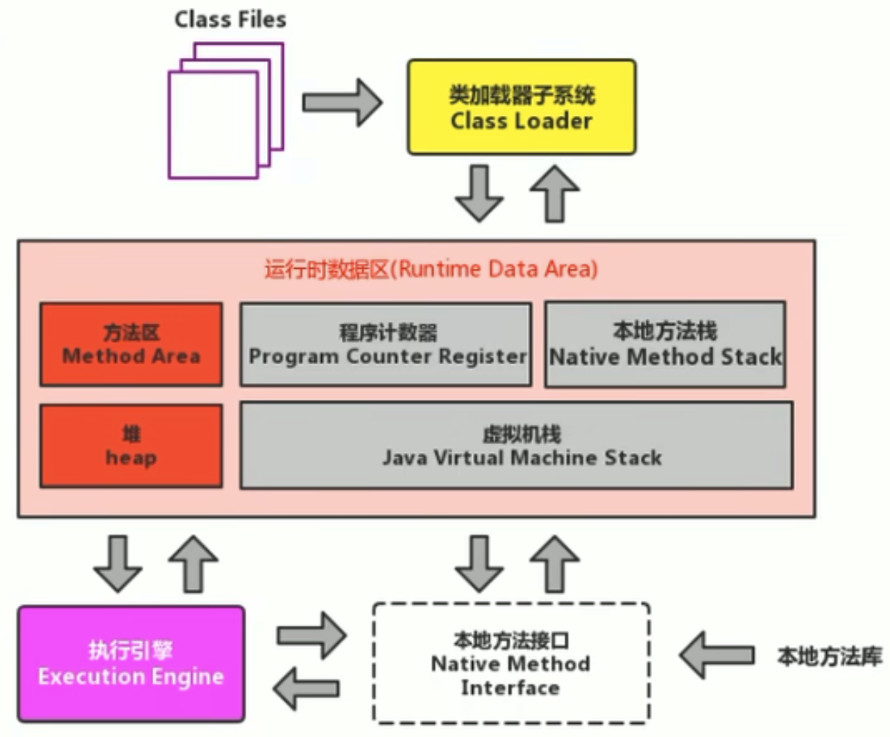
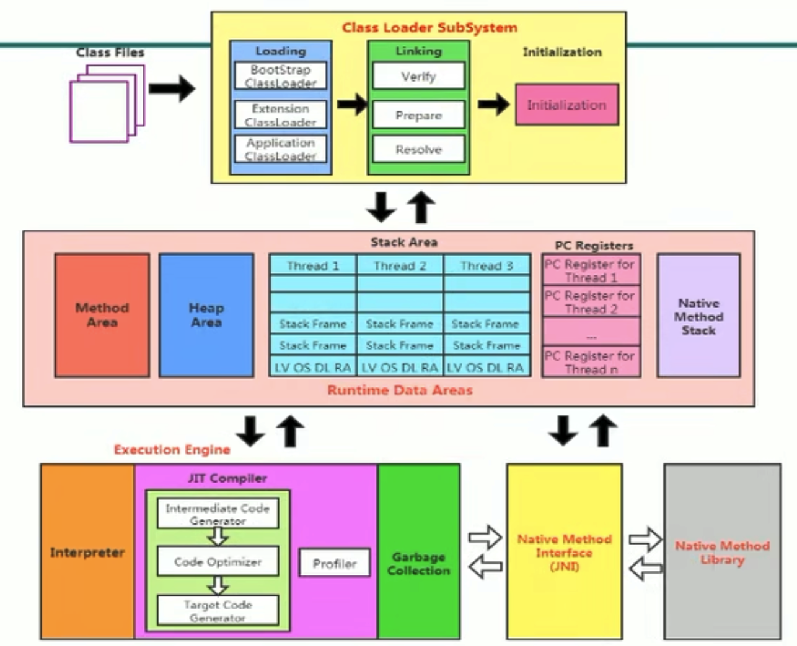
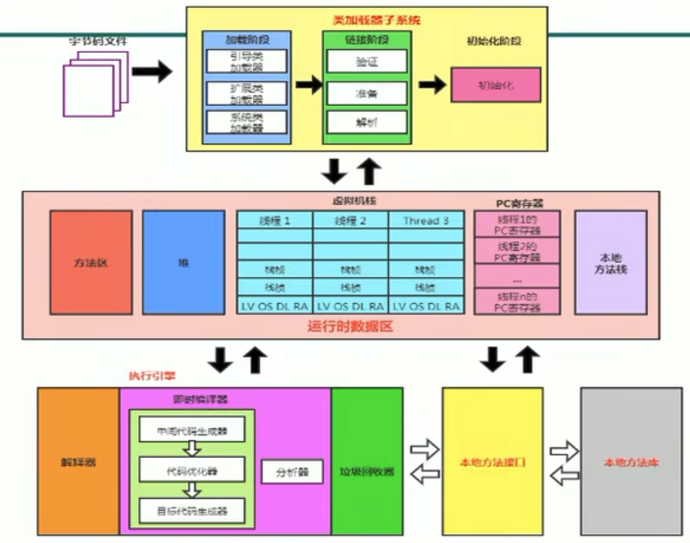
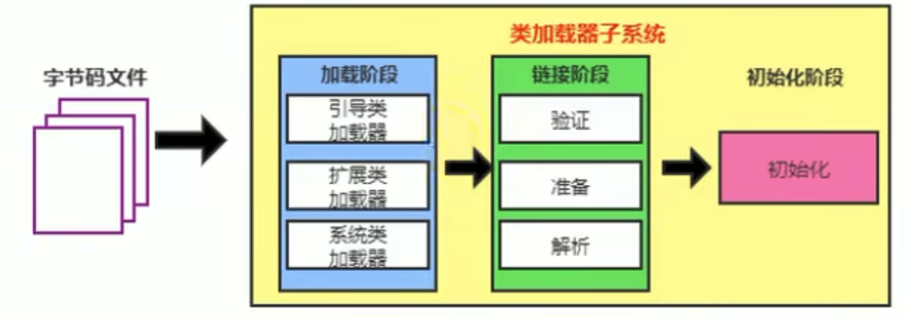
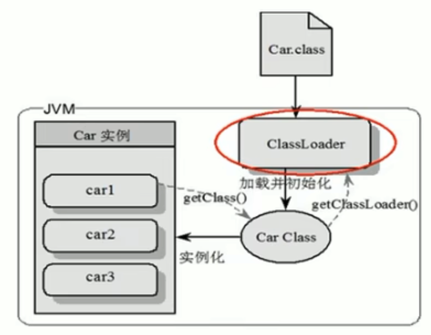
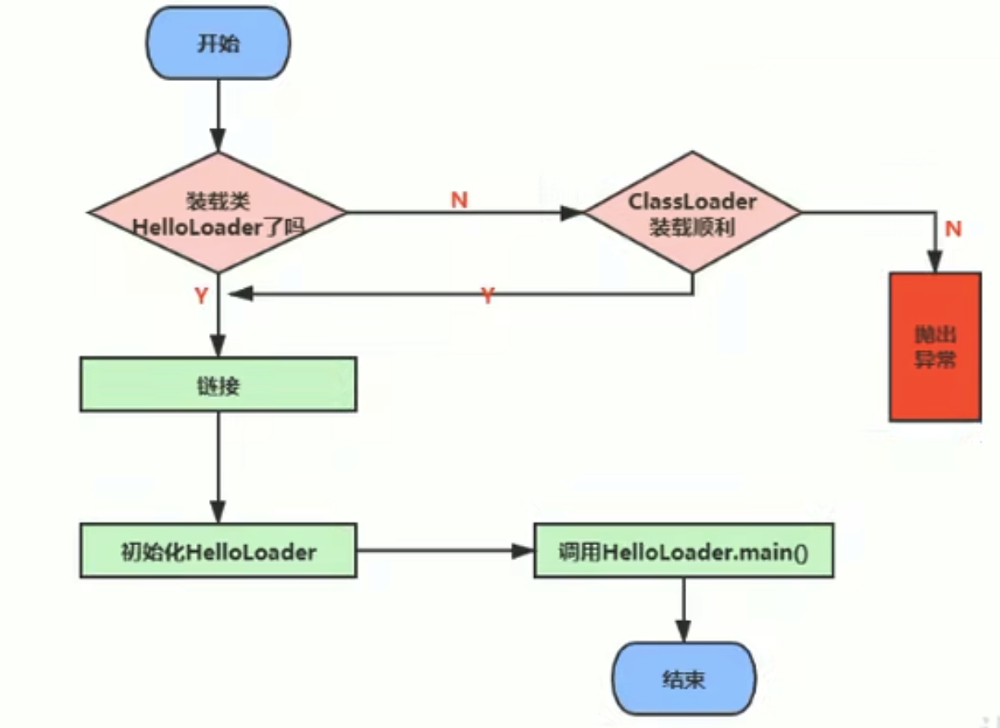

# 類加載子系統

內存結構
--------

簡圖

詳細圖

💡 方法區只有HotSpot虛擬機有，J9、JRockit都沒有。

❓ 如果自己手寫一個Java虛擬機的話，需要考慮哪些結構？ 👉 **類加載器**、**執行引擎**

類加載子系統
------------

類加載子系統作用：

* 類加載器子系統負責從文件系統或者網路中加載Class文件，Class文件在文件頭有特定的文件標示。
* ClassLoader只負責Class文件的加載，至於他是否可以運行，則由Execution Engine決定。
* **加載的類信息存放於一塊稱為方法區的內存空間。除了類的信息外，方法區中還會存放運行時常量池信息，可能還包括字符串字面量和數字常量**(這部分常量信息是Class文件中常量池部分的內存映射)。

類加載器ClassLoader角色
-----------------------

1. Class file存在本地硬盤上，可以理解為設計師畫在紙上的模板，而最終這個模板在執行的時候是要加載到JVM中來根據這個文件實例化出n個一模一樣的實例。
2. **Class file加載到JVM中，被稱為DNA元數據模板，放在方法區**。
3. 在`.class`文件->JVM->最終成為元數據模板，此過程就要一個運輸工具(類裝載器Class Loader)，扮演一個快遞員的角色。

類加載過程
----------

