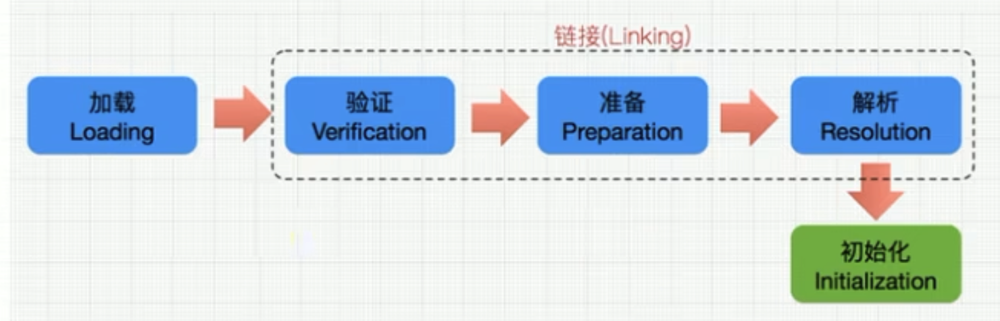
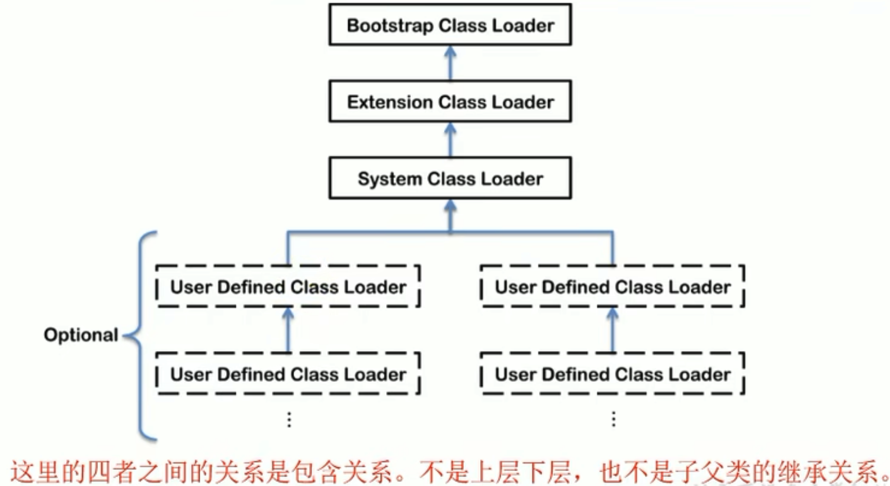

# 類加載子系統

內存結構
--------

簡圖


詳細圖


💡 方法區只有HotSpot虛擬機有，J9、JRockit都沒有。

❓ 如果自己手寫一個Java虛擬機的話，需要考慮哪些結構？ 👉 **類加載器**、**執行引擎**

類加載子系統
------------


類加載子系統作用：

* 類加載器子系統負責從文件系統或者網路中加載Class文件，Class文件在文件頭有特定的文件標示。
* ClassLoader只負責Class文件的加載，至於他是否可以運行，則由Execution Engine決定。
* **加載的類信息存放於一塊稱為方法區的內存空間。除了類的信息外，方法區中還會存放運行時常量池信息，可能還包括字符串字面量和數字常量**(這部分常量信息是Class文件中常量池部分的內存映射)。

類加載器ClassLoader角色
-----------------------


1. Class file存在本地硬盤上，可以理解為設計師畫在紙上的模板，而最終這個模板在執行的時候是要加載到JVM中來根據這個文件實例化出n個一模一樣的實例。
2. **Class file加載到JVM中，被稱為DNA元數據模板，放在方法區**。
3. 在 `.class`文件->JVM->最終成為元數據模板，此過程就要一個運輸工具(類裝載器Class Loader)，扮演一個快遞員的角色。

類加載過程
----------




**加載階段：**

* 加載：

  1. 通過一個類的全限定名獲取定義此類的二進制字節流。
  2. 將這個字節流所代表的靜態存儲結構轉化為**方法區**的運行時數據結構。
  3. **在內存中生成一個代表這個類的 `java.lang.Class`對象**，作為方法區這個類的各種數據的訪問入口。
* 加載 `.class`文件的方式：

  1. 從本地系統中直接加載。
  2. 通過網路獲取，ex. Web Applet。
  3. 從zip壓縮包中讀取，成為日後jar/war格式的基礎
  4. 運行時計算生成，ex. 動態代理技術。
  5. 尤其他文件生成，ex. JSP應用。
  6. 從專有數據庫中提取 `.class`文件(比較少見)。
  7. 從加密文件中獲取，典型的防Class文件被反編譯的保護措施。

**鏈接階段：**(分為**驗證**、**準備**、**解析**三個階段)

1. **驗證(Verify)**：

   * 目的在於確保 `.class`文件的字節流中包含信息符合當前虛擬機要求，保證被加載類的正確性，不會危害虛擬機自身安全。
   * 主要包括4種驗證，文件格式驗證、元數據驗證、字節碼驗證、符號引用驗證。
   * ex. `.class`文件都是以特定的文件標示開頭的。
     
2. **準備(Prepare)**：

   * 為**類變量**分配內存並且設置該類變量的默認初始值，即零值。

     ```java=
     public class HelloApp {
         private static int a = 1; //prepare:a=0 -----> initial a=1

         public static void main(String[] args) {
             System.out.println(a);
         }
     }
     ```
   * **這裏不包含用`final`修飾的`static`，因為`final`在編譯的時候就會分配了，準備階段會顯式初始化**。
   * **這裡不會為實例變量分配初始化**，類變量會分配在方法區中，而實例變量是會隨著對象一起分配到Java堆中。
3. **解析(Resolve)**：

   * 將常量池內的符號引用轉換為直接引用的過程。
   * 解析操作往往是伴隨著JVM在執行完初始化後再執行。
   * 符號引用就是一組符號來描述所引用的目標。符號引用的字面量形式明確定義在<<Java虛擬機規範>>的Class文件格式中。直接引用就是直接指向目標的指針、相對偏移量或一個間接定位到目標的句柄。
     * 符號引用：`javap`解析class文件可以查看符號引用，下面帶`#`的就是符號引用。
       
   * 解析動作主要針對類或接口、字段、類方法、接口方法、方法類型等。對應常量池中的CONSTANT_Class_info、CONSTANT_Fieldref_info、CONSTANT_Methodref_info等。

**初始化階段：**(參考[ClassInitTest.java](chapter02/ClassInitTest.java))

* **初始化階段就是執行類構造器方法`<clinit>()`的過程**。
* 此方法不需要定義，是`javac`編譯器自動收集類中的**所有類變量的賦值動作和靜態代碼快中的語句**合併而來。(有`static`才有`<clinit>()`)
* 構造器方法中的指令按照語句在源文件中出現的**順序**執行。
* **`<clinit>()`不同於類的構造器。(構造器是虛擬機視角下的`<init>()`)**
* 若該類具有父類，JVM會保證子類的`<clinit>()`執行前，父類的`<clinit>()`已經執行完畢。(參考[ParentInitFirstTest.java](chapter02/ParentInitFirstTest.java))
* 虛擬機必須保證一個類的`<clinit>()`方法在多線程下被同步加鎖。(參考[DeadThreadTest.java](chapter02/DeadThreadTest.java))

類加載器的分類
--------------

* JVM支持兩種類型的類加載器，分別為**引導類加載器(Bootstrap ClassLoader)**和**自定義類加載器(User-Defined ClassLoader)**。
* 從概念上來講，自定義加載器一般指的是程序中由開發人員自定義的一類加載器，但是Java虛擬機規範卻沒有這麼定義，而是**將所有派生於抽象類`ClassLoader`的類加載器都劃分為自定義類加載器**。
* 無論類加載器的類型如何劃分，在程序中我們最常見的類加載器始種只有3個，如下：
  
  * Extension Class Loader和System Class Loader都算自定義加載器，他們都繼承了`ClassLoader`。

`ExtClassLoader`


`AppClassLoader`


ex. 參考：[ClassLoaderTest.java](chapter02/ClassLoaderTest.java)

* 我們嘗試獲取引導類加載器BootstrapClassLoader，獲取到的值都是`null`，這不代表引導類加載器不存在，**因為引導類加載器是使用C/C++語言實現的，我們獲取不到**。
* 兩次獲取系統類加載器的值都相同：`sun.misc.Launcher$AppClassLoader@18b4aac2`，說明**系統類加載器是全局唯一的**。

### 虛擬機自帶的加載器

#### 啟動類加載器(引導類加載器，Bootstrap ClassLoader)

* 這個類**使用C/C++語言實現的**，嵌套在JVM內部。
* 他用來加載Java的核心庫(`JAVA_HOME/jre/lib/rt.jar`、`resources.jar`或`sun.boot.path`路徑下的內容)，用於提供JVM自身需要的類。
* 並不繼承自`java.lang.ClassLoader`，沒有父加載器。
* 加載擴展類和應用程序類加載器，並指定為他們的父加載器。
* 出於安全考慮，Bootstrap啟動類加載器只加載包名為`java`、`javax`、`sun`等開頭的類。

#### 擴展類加載器(Extension ClassLoader)

* **Java語言編**寫，由`sun.misc.Launcher$ExtClassLoader`實現。
* 派生於`ClassLoader`類。
* 父類加載器為啟動類加載器。
* 從`java.ext.dirs`系統屬性所指定的目錄中加載類庫，或從JDK的安裝目錄的`jre/lib/ext`子目錄(擴展目錄)下加載類庫。**如果用戶創建的JAR放在此目錄下，也會自動由擴展類加載器加載**。

#### 應用程序類加載器(系統類加載器，AppClassLoader)

* **Java語言編**寫，由`sun.misc.Launcher$AppClassLoader`實現。
* 派生於`ClassLoader`類。
* 父類加載器為啟動類加載器。
* 他負責加載環境變量classpath或系統屬性`java.class.path`指定路徑下的類庫。
* **該類加載是程序中默認的類加載器**，一般來說，Java應用的類都是由他來完成加載。
* 通過`ClassLoader#getSystemClassLoader()`方法可以獲取到該類加載器。

ex. 參考：[ClassLoaderTest1.java](chapter02/ClassLoaderTest1.java)

### 用戶自定義類加載器

#### 什麼時候需要自定義類加載器

* 在Java的日常應用程序開發中，類的加載幾乎是由上述3種類加載器相互配合執行的，在必要時，我們還可以自定義類加載器，來定製類的加載方式。
* 為什麼要自定義類加載器？
  * 隔離加載類(同一個項目引入多個框架，可能會引入某些類的全限定名相同，這時候就衝突了，一般主流的框架和中間件都會自定義類加載器，實現不同框架、中間件是隔離的)
  * 修改類加載的方式
  * 擴展加載源(從其他來源去加載類)
  * 防止源碼洩漏(對字節碼文件進行加密，自己使用時通過自定義類加載器實現解密)

#### 如何自定義類加載器

1. 開發人員可以通過繼承抽象類`java.lang.ClassLoader`類，實現自己的類加載器，以滿足一些需求。
2. JDK1.2之前，載自定義類加載器時，總會去繼承`ClassLoader`類並重寫`loadClass()`方法，從而實現自定義的類加載類，JDK1.2後，已不再建議用戶去重寫`loadClass()`方法，而是建議把自定義的類加載邏輯寫在`findClass()`方法中。
3. 在編寫自定義類加載器時，如果沒有太過複雜的需求，可以直接繼承`URLClassLoader`類，這樣就可以避免自己去編寫`findClass()`方法和獲取字節碼流的方式，使自定義類加載器更加簡潔。

ex. 參考：[CustomClassLoader.java](chapter02/CustomClassLoader.java)

關於ClassLoader
---------------

`ClassLoader`類是一個抽象類，其後所有的類加載器都繼承自`ClassLoader`(不包含啟動類加載器)


`sun.misc.Launcer`他是一個Java虛擬機的入口應用。


獲取ClassLoader的途徑：(參考[GetClassLoaderTest.java](chapter02/GetClassLoaderTest.java))


雙親委派機制
------------

Java虛擬機對Class文件採用的是**按需加載**的方式，也就是說當需要使用該類時他才會將他的Class文件加載到內存生成Class對象。而且加載某個類的Class文件時，Java虛擬機採用的是**雙親委派模**式，即**把請求交由給父類處理，他是一種任務委派模式**。

*原理*：


1. 如果一個類加載器收到了類加載請求，他並不會自己先去加載，而是把這個請求委託給父類的加載器去執行。
2. 如果父類加載器還存在其父類加載器，則進一步向上委託，依次遞歸，請求最終將到達頂層的啟動類加載器Bootstrap ClassLoader。
3. 如果父類加載器可以完成類加載任務，就成功返回，如果父類加載器無法完成此加載任務，子加載器才會嘗試自己去加載，這就是雙親委派模式。

*範例1*：參考[StringTest.java](chapter02/StringTest.java)和[String.java](../../../java/lang/String.java)

*範例2*：當我們加載`jdbc.jar`用於實現數據庫連接的時候


1. 我們現在程序中需要用到SPI接口，而SPI接口屬於`rt.jar`包中Java核心API。
2. 然後使用雙親委派機制，**引導類加載器把`rt.jar`包加載進來**，而`rt.jar`包中的SPI存在一些接口，接口我們就需要具體的實現類。
3. 具體的實現類就涉及到某些第三方的jar包，例如我們加載SPI的實現類`jdbc.jar`包。(首先我們需要知道的是`jdbc.jar`是基於SPI接口進行實現的)
4. **第三方的jar包中的類屬於系統類加載器來加載**。
5. 從這裡面就可以看到**SPI核心接口由引導類加載器來加載，SPI具體實現類由系統類加載器來加載**。

### 雙親委派優勢

1. 避免類的重複加載。
2. 保護程序安全，防止核心API被隨意串改。
   * 自定義類：自定義的`java.lang.String`([String.java](../../../java/lang/String.java))沒有被加載。
   * 自定義類：自定義的`java.lang.Start`([Start.java](../../../java/lang/Start.java))，會阻止創建`java.lang`開頭的類

沙箱安全機制
------------

自定義`String`類時，在加載自定義`String`類的時候會率先使用引導類加載器加載，而引導類加載器在加載的過程中會先加載JDK自帶的文件(`rt.jar`包中的`java\lang\String.class`)，報錯信息說沒有`main`方法，就是因為加載的是`rt.jar`包中的`String`類。這樣可以保證對java核心源代碼的保護，這就是**沙箱安全機制**。

其他
----

*如何判斷兩個Class是否相同？*

1. 類的完整類名必須一致，包括包名。
2. **加載這個類的`ClassLoader`(指`ClassLoader`實例對象)必須相同**。
3. 換句話說，在JVM中即使這兩個類對象(`Class`對象)來源同一個Class文件，被同一個虛擬機鎖加載，但只要加載他們的`ClassLoader`實例對象不同，那麼這兩個類對象也不是相等的。

*對類加載器的引用：*

1. JVM必須知道一個類型是由啟動類加載器加載還是由用戶類加載器加載的。
2. 如果一個類型是由用戶類加載器加載的，那麼**JVM會將這個類加載器的一個引用作為類型信息的一部分保存在方法區中**。
3. 當解析一個類型到另一個類型的引用時，JVM需要暴政這兩個類型的類加載器是相同的。

*Java程序對類的使用方式分為：主動使用和被動使用*
主動使用又分為7種情況：

* 創建類的實例。
* 訪問某個類或接口的靜態變量，或者對靜態變量賦值。
* 調用類的靜態方法。
* 反射(比如`Class.forName("xxx.xxx.Xxx")`)。
* 初始化一個類的子類。
* Java虛擬機啟動時被標名為啟動類的類。
* JDK7開始提供的動態語言支持：`java.lang.invoke.MethodHandle`實例的解析結果REF_getStatic、REF_putStatic、REF_invokeStatic句柄對應的類沒有初始化，則初始化。

除了以上7種情況，其他使用Java類的方式都被看作是對**類的被動使用**，都**不會導致類的初始化**。
