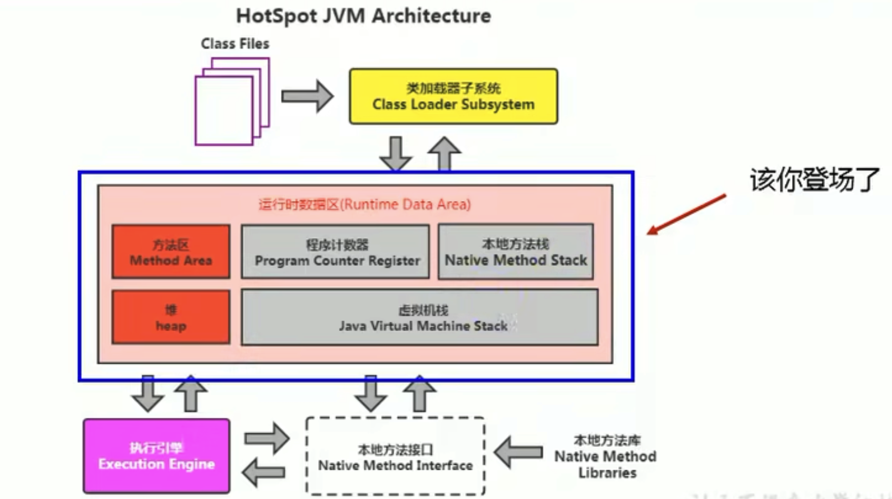
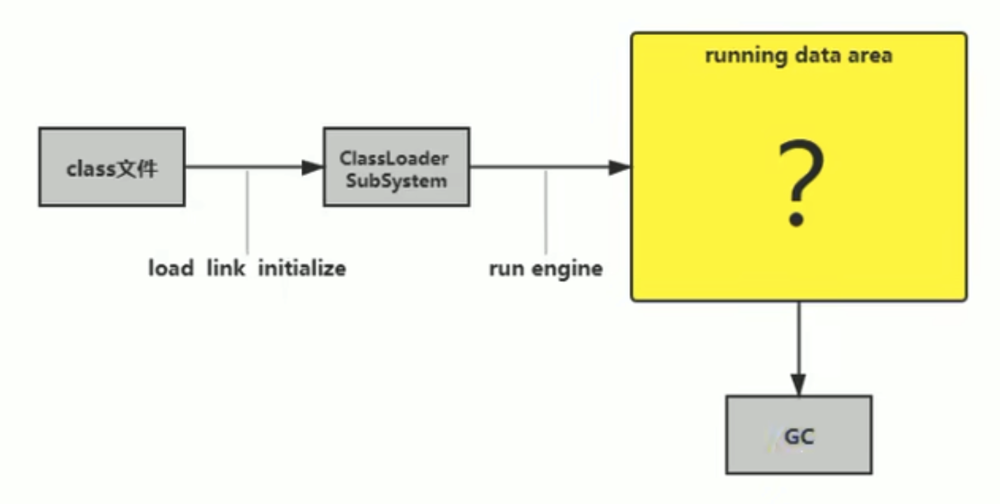
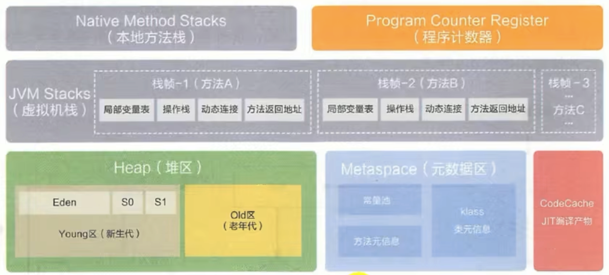
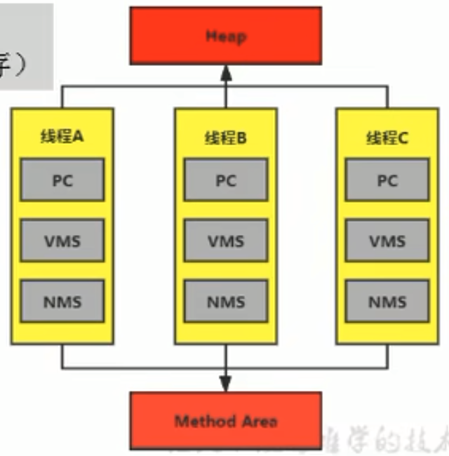
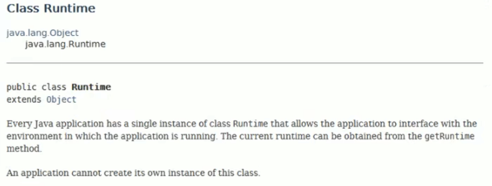

# 運行時數據區

當我們通過類的加載 -> 驗證 -> 準備 -> 解析 -> 初始化，這幾個階段後，就會用到執行引擎對我們的類進行使用，同時執行引擎會使用到我們的運行時數據區。

運行時數據區結構
----------------

內存是非常重要的系統資源，是硬盤和CPU的中間倉庫和橋樑，乘載著操作系統和應用程序的實例運行。JVM內存佈局規定了Java在運行過程中內存申請、分配、管理的策略，保證了JVM的高效穩定運行。**不同的JVM對於內存的劃分方式和管理機制存在著部分差異**。結合JVM虛擬機規範，探討一下經典的JVM內存佈局。

**通過磁盤或網路IO得到的數據，都需要先加載到內存中，然後CPU從內存中獲取數據進行讀取，也就是說內存充當了CPU和硬盤之間的橋樑**。

Java虛擬機定義了若干種程序運行期間會使用到的運行時數據，其中有一些會隨著虛擬機啟動而創建，隨著虛擬機退出而銷毀。另外一些則是與線程一一對應的，這些與線程對應的數據區會隨著線程開始和結束而創建和銷毀。

灰色的為單獨線程私有的，紅色的為多個線程共享的。即：

* 每個線程：獨立包括程序計數器、棧、本地棧。
* 線程間共享：堆、堆外內存(永久代或元空間(都是方法區的落地實現)、代碼緩存)。

### `Runtime`類

**每個JVM只有一個`Runtime`類實例**。即運行時環境，相當於內存結構中間的框框：運行時環境。

線程
----

* 線程是一個程序裡的運行單位。JVM允許一個應用有多個線程并行的執行。
* **在HotSpot JVM中，每個線程都與操作系統的本地線程直接映射**。
  * 當一個Java線程準備好執行以後，此時一個操作系統的本地線程也同時創建。Java線程執行終止後，本地線程也會回收。
* **操作系統負責所有線程的安排調度到任何一個可用的CPU上**。一但本地線程初始化成功，他就會調用Java線程中的`run()`方法。

### JVM系統線程

* 如果使用jconsole或者是任何一個調試工具，都可以看到在後台有許多線程在運行。這些後台線程不包括調用的`main()`方法線程以及所有這個`main()`線程自己創建的線程。
* 這些主要的後台系統線程在HotSpot JVM裡主要是以下幾個：
  * **虛擬機線程**：這種線程的操作是需要JVM達到安全點才會出現。這些操作必須在不同的線程中發生的原因是他們都需要JVM達到安全點，這樣堆才不會變化。這種線程的執行類型包括"stop-the-world"的垃圾收集，線程棧收集，線程掛起以及偏向鎖撤銷。
  * **週期任務線程**：這種線程是時間週期事件的體現(比如中斷)，他們一般用於週期性操作的調度執行。
  * **GC線程**：這種線程對在JVM裡不同種類的垃圾收集行為提供了支持。
  * **編譯線程**：這種線程在運行時會將字節碼編譯成到本地代碼。
  * **信號調度線程**：這種線程接收信號並發給JVM，在他內部通過調用適當的方法進行處理。

