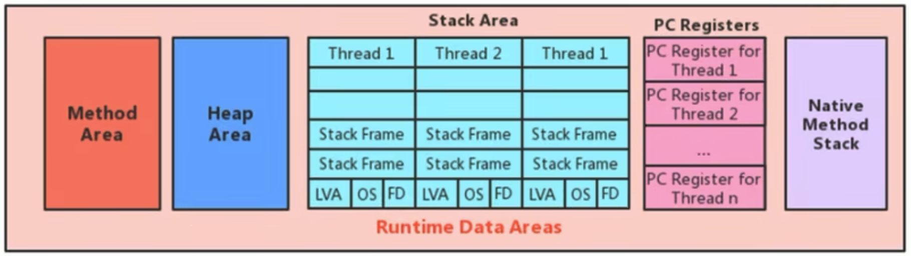
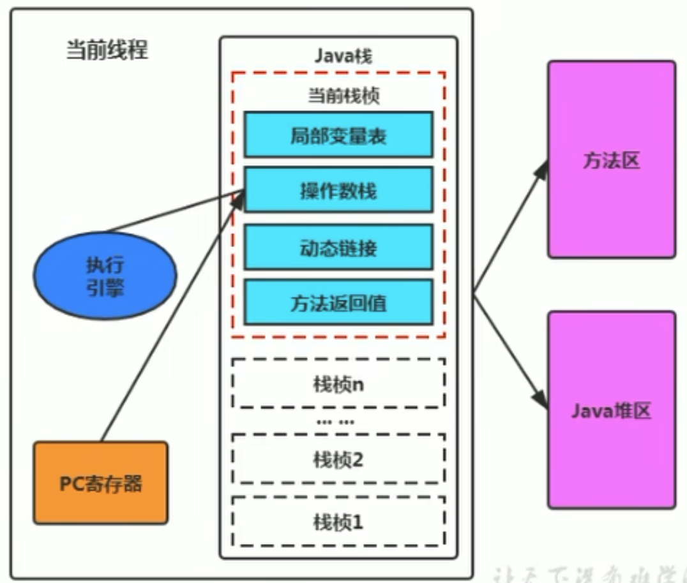
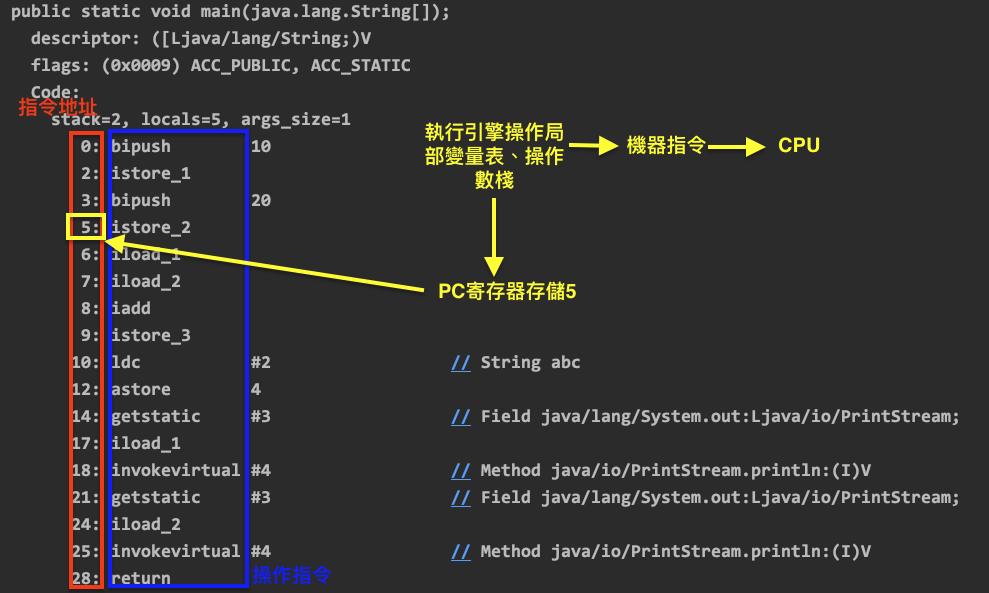
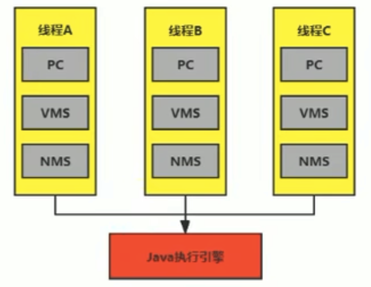
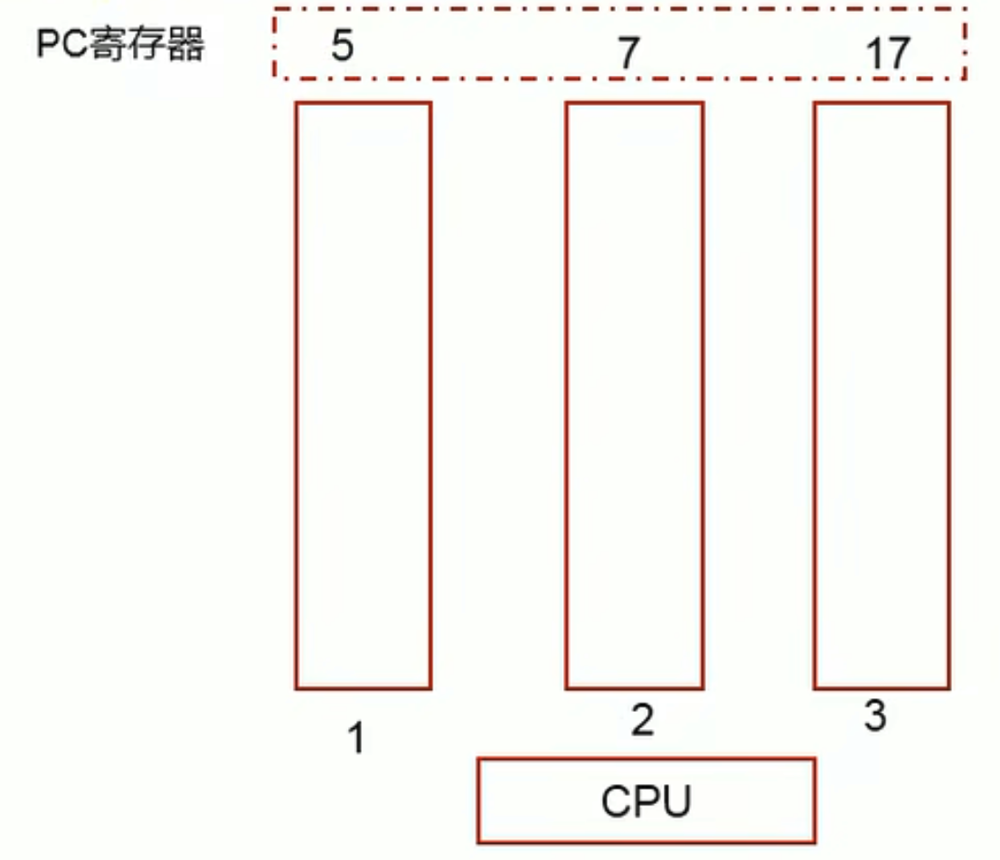

# 程序計數器(PC寄存器)

PC Register介紹
---------------

* JVM中的程序計數寄存器(Program Counter Register)中，Register的命名源於CPU的寄存器，**寄存器存儲指令相關的現場信息**。CPU只有把數據裝載到寄存器才能運行。
* 這裡並非是廣義上所指的物理寄存器，或許將其翻譯為PC計數器(或指令計數器)會更貼切(也稱為程序鉤子，勾著一行一行的代碼，執行完上一行了下一行該執行誰，由這個鉤子來紀錄)，並且也不容易引起一些不必要的誤會。**JVM中的PC寄存器是對物理PC寄存器的一種抽象模擬**。
* 他是一塊很小的內存空間，幾乎可以忽略不計。也是運行速度最快的存儲區域。
* 在JVM規範中，每個線程都有他自己的程序計數器，是線程私有的，生命週期與線程的生命週期保持一致。
* 任何時間一個線程都只有一個方法在執行，也就是所謂的**當前方法**。**程序計數器會存儲當前線程正在執行的Java方法的JVM指令地址，或者如果是在執行`native`方法，則是未指定值(`undefined`)**。
* 他是程序控制流的指示器，分支、循環、跳轉、異常處理、線程恢復等基礎功能都需要依賴這個計數器來完成。
* 字節碼解釋器工作就是通過改變這個計數器的值來選取下一條需要執行的字節碼指令。
* 他是唯一一個在Java虛擬機規範中沒有規定任何OutOfMemoryError情況的區域。

## PC Register作用

PC寄存器用來**存儲指向下一條指令的地址**，也即將要執行的指令代碼。由執行引擎讀取下一條指令。

舉例
----

參考：[PCRegisterTest.java](chapter04/PCRegisterTest.java)，編譯後移動到`target`目錄，使用`javap -v PCRegisterTest`解析字節碼文件。

💡 左邊的數字就是**指令地址**(指令偏移)，PC寄存器所存儲的結構。

常見問題
--------

❓使用PC寄存器存儲字節碼指令有什麼用？為什麼使用PC寄存器紀錄當前線程的執行地址呢？

* 因為**CPU需要不停地切換各個線程，這時候切換回來以後，得知道接著從哪裡開始繼續執行**。
* JVM的字節碼解釋器就需要通過改變PC寄存器的值來明確下一條應該執行什麼樣的字節碼指令。

❓PC寄存器為什麼被設定為線程私有？

* 我們都知道所謂的多線程在一個特定的時間段內只會執行其中某一個線程的方法，CPU會不停做任務切換，這樣必然導致經常中斷或恢復，如何保證分毫無差呢？**為了能夠準確紀錄各個線程正在執行的當前字節碼指令地址，最好的辦法自然是為每一個線程都分配一個PC寄存器**，這樣一來各個線程之間變可以進行獨立計算，從而不會出現相互干擾的情況。
* 由於CPU時間片輪限制，中多線程在并發執行過程中，**任何一個確定的時刻，一個處理器或多核處理器中的一個內核，只會執行某個線程中的一條指令**(互相切換)。
* 這樣必然導致經常中斷或恢復，如何保證分毫無差呢？每個線程在創建後，都會產生自己的程序計數器和棧幀，程序計數器在各個線程之間互相不影響。

CPU時間片
---------

* **CPU時間片即CPU分配給各個程序的時間**，每個線程被分配一個時間段，稱作他的時間片。
* 在宏觀上：我們可以同時打開多個應用程序，每個程序并行不悖，同時運行。
* 在微觀上：由於只有一個CPU，一次只能處理程序要求的一部分，如何處理公平，一種方法就是引入時間片，每個程序輪流執行(輪流切換)。

💡 并行：同一個時間兩個線程分別訪問各自的資源。
💡 并發：同一時間兩個線程訪問同一個資源。

