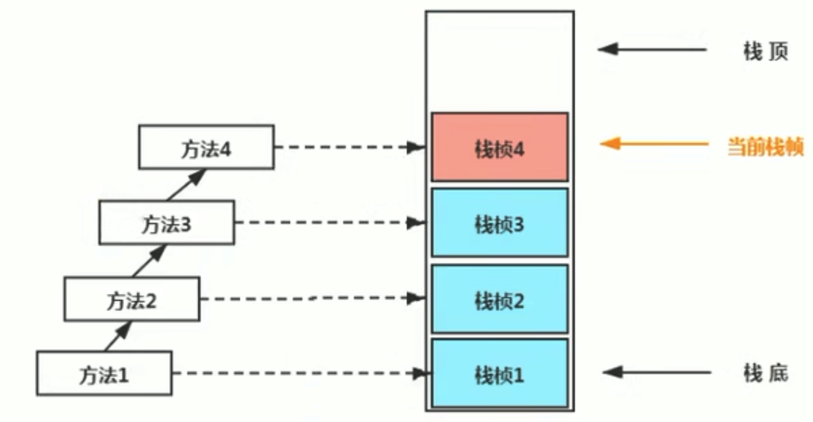
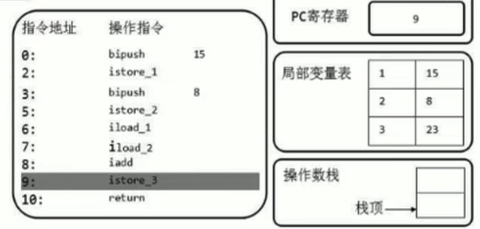
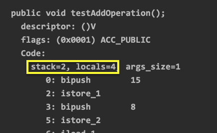
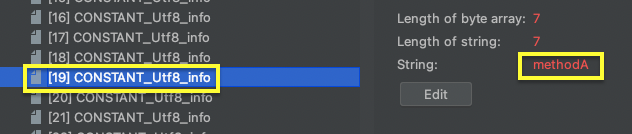

# 虛擬機棧

虛擬機棧概述
------------

### 背景

* 由於跨平台的設計，Java的指令都是根據棧來設計的。不同平台CPU架構不同，所以不能設計為基於寄存器的。
* **優點是跨平台，指令集小，編譯器容易實現，缺點是性能下降，實現同樣的功能需要更多指令**。

### 內存中的棧與堆

* **棧是運行時的單位，堆是存儲的單位**。
* 棧解決程序的運行問題，即程序如何執行，或者說如何處理數據。堆解決的是數據存儲的問題，即數據怎麼放、放在哪。


### 虛擬機棧基本內容

* Java虛擬機棧是什麼？
  * Java虛擬機棧(Java Virtual Machine Stack)，早期也叫Java棧。每個線程在創建時都會創建一個虛擬機棧，**其內部保存一個個的棧幀(Stack Frame)，對應一次次的方法調用**，棧是線程私有的。:point_right:參考[StackTest.java](chapter05/StackTest.java)
    
* 生命週期
  * 生命週期和線程一致。
* 作用
  * 主管Java程序的運行，保存方法的局部變量(8種基本數據類型、對象的引用地址)、部分結果，並參與方法的調用和返回。
  * 局部變量，他是相比於成員變量(屬性)的。
  * 基本數據變量 vs 引用類型變量(類、數組、接口)

### 虛擬機棧特點

* 棧是一種快速有效的分配存儲方式，訪問速度僅次於程序計數器。
* JVM直接對Java棧的操作只有2個：
  * 每個方法執行，伴隨著**進棧**(入棧、壓棧)。
  * 執行結束後的**出棧**工作。
* 對於棧來說不存在垃圾回收問題。
  * **棧不存在GC，但是可能存在OOM**。


### 虛擬機棧的異常

Java虛擬機規範允許**Java棧的大小是動態的或者是固定不變的**。

* 如果採用**固定**大小的Java虛擬機棧，那每一個線程的Java虛擬機棧容量可以在線程創建的時候獨立選定。如果線程請求分配的棧容量超過Java虛擬機棧允許的最大容量，Java虛擬機會拋出一個**StackOverflowError**異常。
* 如果Java虛擬機棧可以**動態擴展**，並且在嘗試擴展的時候無法申請到足夠的內存，或者在創建新的線程時沒有足夠的內存去創建對應的虛擬機棧，那Java虛擬機將會拋出一個**OutOfMemoryError**異常。

參考[StackErrorTest.java](chapter05/StackErrorTest.java)

### 設置棧內存大小

我們可以使用參數`-Xss`選項來設置線程最大棧空間，棧的大小直接決定了函數調用的最大可達深度。


ex.

```
-Xss1m
-Xss1024k
-Xss1048576
```

💡 參考[StackErrorTest.java](chapter05/StackErrorTest.java) 運行並設置**VM Option**s `-Xss256k`


棧的存儲單位
------------

### 棧中存儲什麼？

* 每個線程都有自己的棧，棧中的數據都是以**棧幀(Stack Frame)的格式**存在。
* 在這個線程上正在執行的**每個方法都各自對應一個棧幀(Stack Frame)**。
* 棧幀是一個內存區塊，是一個數據集，維繫著方法執行過程中的各種數據信息。

### 棧運行原理

* JVM直接對Java棧的操作只有兩個，就是對棧幀的**壓棧**和**出棧**，遵循"**先進後出**"/"**後進先出**" 原則。
* 在一條活動線程中，一個時間點上，只會有一個活動的棧幀。即只有當前正在執行的方法的棧幀(棧頂棧幀)是有效的，這個棧幀被稱為**當前棧幀(Current Frame)**，與當前棧幀相對應的方法就是**當前方法(Current Method)**，定義這個方法的類就是**當前類(Current Class)**。
* 執行引擎運行的所有字節碼指令只針對當前棧幀進行操作。
* 如果在該方法中調用了其他方法，對應的新的棧幀會被創建出來，放在棧的頂端，成為新的當前幀。



💡 參考[StackFrameTest.java](chapter05/StackFrameTest.java)，Debug也可以看到Frame結構


* **不同線程中所包含的棧幀是不允許存在相互引用的**，即不可能在一個棧幀之中引用另外一個線程的棧幀。
* 如果當前方法調用了其他方法，方法返回之際，當前棧幀會傳回此方法的執行結果給前一個棧幀，接著，虛擬機會丟棄當前棧幀，使得前一個棧幀重新成為當前棧幀。
* Java方法有兩種返回函數的方式，**一種是正常的函數返回，使用`return`指令，另一種是拋出異常(沒有處理的異常)。不管使用哪種方式，都會導致棧幀被彈出**。

### 棧幀的內部結構

每個棧幀中存儲著：

* **局部變量表(Local Variables)**
* **操作數棧(Operand Stack) (或表達式棧)**
* 動態鏈接(Dynamic Linking) (或指向運行時常量池的方法引用)
* 方法返回地址(Return Address) (或方法正常退出或者異常退出的定義)
* 一些附加信息


局部變量表(Local Variables)
---------------------------

* 局部變量表也被稱為局部變量數組或本地變量表。
* **定義為一個數字數組，主要用於存儲方法參數和定義在方法體內的局部變量，這些數據類型包括各類基本數據類型、對象引用(reference)，以及returnAddress類型**。
* 由於局部變量表是建立在線程的棧上，是線程私有的數據，因此**不存在數據安全問題**。
* **局部變量表所需的容量大小是在編譯期確定下來的**，並保存在方法的Code屬性的maximum local variables數據項中。在方法運行期間是不會改變局部變量表大小的。
* **方法嵌套調用的次數由棧的大小決定**。一般來說，**棧越大，方法嵌套調用次數越多**。對一個函數而言，他的參數和局部變量越多，使得局部變量表膨脹，他的棧幀就越大，以滿足方法調用所需傳遞的信息增大的需求。進而函數調用就會佔用更多的棧空間，導致其嵌套調用次數就會減少。
* **局部變量表中的變量只在當前方法調用中有效**。在方法執行時，虛擬機通過使用局部變量表完成參數直到參數變量列表的傳遞過程。**當方法調用結束後，隨著方法棧幀的銷毀，局部變量表也會隨之銷毀**。

💡 參考[LocalVariablesTest.java](chapter05/LocalVariablesTest.java)，運行後，使用`javap -v LocalVariableTest`解析字節碼文件


💡 結論：局部變量表所需的容量大小是在編譯期就確定了。

使用jclasslib來查看

1. 具體的字節碼
   
2. 方法異常表信息(`main()`方法沒有拋異常，所以是空的)
   
3. Misc顯示有3個局部變量、字節碼有16行
   
4. LineNumberTable行號表 :point_right: LineNumber(Java代碼的行號) 和 Start PC(字節碼的行號) 的對應關係
   
5. LocalVariableTable局部變量表
   
   * Start PC：字節碼指令的行號
   * Start PC(變量起始作用位置，從聲明的下一行有效)和Length(作用的長度)合起來描述當前**變量作用域的範圍**
   * Description中`Ljava/lang/String`中的`L`代表引用類型

### 關於Slot的理解

* 參數值的存放總是在局部變量數組的index0開始，到數組長度-1的索引結束。
* **局部變量表，最基本的存儲單元是Slot(變量槽)**。
* 局部變量表中存放編譯其可知的各種基本數據類型(8種)，引用類型(reference)，returnAddress類型的變量。
* 在局部變量表裡，**32位以內的類型只佔用一個slot(包括returnAddress類型)，64位的類型(`doubl`和`long`)佔用2個slot**。
  * `byte`、`short`、`char`在存儲前被轉換為`int`，`boolean`也被轉換為`int`，`0`表示`false`，非`0`表示`true`。
  * `double`和`long`則佔據2個slot。
* JVM會為局部變量表中的每一個slot都分配一個訪問索引，通過這個索引即可成功訪問到局部變量表中指定的局部變量值。
* 當一個實例方法被調用的時候，他的方法參數和方法體內部定義的局部變量將會**按照順序被複製**到局部變量表中的每一個Slot上。
* **如果需要訪問局部變量表中一個64Bit(佔用2個Slot)的局部變量值時，只需要使用前面的一個索引即可**(例如訪問`long`或`double`的變量)。
  
* 如果當前幀是由**構造方法**或者**實例方法**創建的，那麼**該對象引用的`this`將會存放在index0的slot處**，其餘的參數按照參數表順序繼續排列。
  


### Slot的重複利用

**棧幀中的局部變量表中槽位是可以重用的**，如果一個局部變量過了其作用域，那麼在其作用域之後聲明的新的局部變量就很有可能會複用過期局部變量的槽位，從而達到**節省資源**的目的。

💡 參考[LocalVariablesTest.java](chapter05/LocalVariablesTest.java)的`test4()`方法，`b`出了大括號就銷毀了，不過數組的位置已經開闢了，再聲明`c`的時候就重複利用index2的位置(原本是變量`b`的位置)。


### 靜態變量與局部變量的對比

> 變量的分類：
> 
> 1. 按照數據類型分：基本數據類型、引用數據類型。
> 2. 按照在類中聲明的位置分：
>    1. 成員變量：在使用前，都經過默認初始化賦值。
>       1. 類變量：linking的prepare階段，給類變量默認賦值 ---> initialization階段給類變量顯式及靜態代碼塊賦值。
>       2. 實例變量：隨著對象的創建，會在堆空間中分配實例變量空間，並進行默認賦值。
>    2. 局部變量：在使用前，必須要進行顯式賦值的！否則編譯不通過。

* 參數表分配完畢之後，再根據方法體內定義的變量的順序和作用域分配。
* 我們知道類變量表有2次初始化的機會，第一次是在"**準備階段**"，執行系統初始化，對類變量設置零值，另一次則是在"**初始化**"階段，賦予程序員在代碼快中定義的初始值。
* 和類變量初始化不同的是，局部變量表不存在系統初始化的過程，這意味著一但定義了局部變量則**必須人為初始化**，否則無法使用。

*補充說明*：

* 在棧幀中，與性能條優關係最為密切的部分就是前面提到的局部變量表。在方法執行時，虛擬機使用局部變量表完成方法的傳遞。
* **局部變量表中的變量也是重要的垃圾回收根節點，只要被局部變量表中直接或間接引用的對象都不會被回收**。

操作數棧(Operand Stack)
-----------------------

### 操作數棧的特點

* 每一個獨立的棧幀除了包含局部變量表之外，還包含一個後進先出(Last-In-First-Out)的操作數棧，也可稱之為表達式棧(Expression Stack)。
* 操作數棧，在方法執行過程中，根據字節碼指令，往棧中寫入數據或提取數據，即入棧(push)/出棧(pop)。
  * 某些字節碼指令將值壓入操作數棧，其餘的字節碼指令將操作數取出棧。使用它們後再把結果壓入棧。
  * ex. 執行複製、交換、求和等操作


### 操作數棧的作用

* 操作數棧，**主要用於保存計算過程的中間結果，同時作為計算過程中變量臨時的存儲空間**。
* 操作數棧就是JVM執行引擎的一個工作區，當一個方法剛開始執行的時候，一個新的棧幀也會隨之被創建出來，這個方法的操作數棧是空的。
* 每一個操作數棧都會擁有一個明確的棧深度用於存儲數值，其所需的最大深度在編譯期就定義好了，保存在方法的Code屬性中，為`max_stack`的值。
* 棧中的任何一個元素都是可以任意的Java數據類型。
  * 32bit的類型佔用一個棧單位深度。
  * 64bit的類型佔用二個棧單位深度。
* 操作數棧**並非採用訪問索引的方式來進行數據訪問的**，而是只能通過標準的入棧(push)/出棧(pop)操作來完成一次數據方問。
* **如果被調用的方法帶有返回值的話，其返回值將會被壓入當前棧幀的操作數棧中**，並更新PC寄存器中下一條需要執行的字節碼指令。
* 操作數棧中元素的數據類型必須與字節碼指令的序列嚴格匹配，這由編譯器在編譯期間進行驗證，同時在類加載過程中的類檢驗階段的數據流分析階段要再次驗證。
* 另外，我們說Java虛擬機的**解釋引擎是基於棧的執行引擎**，其中的棧指的就是操作數棧。

### 操作數棧代碼追蹤

#### 案例1

參考[OperandStackTest.java](chapter05/OperandStackTest.java)的`testAddOperation()`方法。


1. PC寄存器指向0，就是指令地址為0的指令，使用`bipush`讓操作數15入操作數棧。
   
2. PC寄存器往下移，指向下一行代碼，下一行代碼就是將操作數棧的元素存儲到局部變量表下標為1的位置(`istore_1`)(`byte`、`short`、`char`、`boolean`類型存儲的是`int`)，此時局部變量表加了一個元素，並且操作數棧為空了。
   
   
   * 這邊存儲在index1的位置，是因為**index0存儲的是`this`**。
3. PC下移，讓操作數8也入棧
   
4. PC下移，執行`istore_2`存儲至局部變量表中。
   
5. `iload_1`：將局部變量表中索引為1的數據壓入操作數棧中。
   
6. `iload_2`：將局部變量表中索引為2的數據壓入操作數棧中。
   
7. `iadd`：將操作數棧中的兩個元素出棧並相加，並放到操作數棧中。
   
8. `istore_3`：將操作數棧中相加後的結果存儲至局部變量表中。
   
9. 最後`return`結束。


💡 過程中操作數棧使用2個空間、局部變量表使用4個空間(包含`this`)。



*擴展*：


* 因為8可以存放在`byte`類型中，所以壓入操作數棧的類型為`byte`，而不是`int`，所以執行字節碼指令為`bipush8`。
* 在存儲局部變量表時，會轉成`int`類型：`istore_4`。


* 改成800後，`byte`存儲不下，就變成`short`型別，`sipush800`。

#### 案例2(方法帶有返回值，返回值入操作數棧)

參考[OperandStackTest.java](chapter05/OperandStackTest.java)的`getSum()`和`testGetSum()`方法。


* `getSum()`方法最後帶著`ireturn`。


* `testGetSum()`方法一開始先`aload_0`加載`this`並調用`getSum()`方法獲取返回值，並保存在操作數棧中。

棧頂緩存(Top-of-Stack Caching)
------------------------------

* 基於棧式架構的虛擬機所使用的零地址指令更加緊湊，但完成一項操作的時候必然需要使用更多的入棧和出棧指令，這同時也就意味著需要更多的指令分派(instruction dispatch)次數和內存讀/寫次數。
* 由於操作數是存儲在內存中的，因此頻繁地執行內存讀/寫必然會影響執行速度。為了解決這個問題，HotSpot VM設置者們提出了棧頂緩存(ToS，Top-of-Stack Caching)，**將棧頂元素全部緩存在物理CPU的寄存器中，以此降低對內存的讀/寫次數，提升執行引擎的執行效率**。

動態鏈接(Dynamic Linking)
-------------------------

指向運行時常量池的方法引用。

* 每一個棧幀內部都包含一個指向**運行時常量池**中**該棧幀所屬方法的引用**。包含這個引用的目的就是為了支持當前方法的代碼能夠實現**動態鏈接(Dynamic Linking)**。比如invokedynamic指令。
* 在Java源文件被編譯到字節碼文件中時，所有的變量和方法引用都作為符號引用(Symbolic Reference)保存在class文件的常量池裡。ex. 一個方法調用了另外的其他方法時，就是通過常量池中指向方法的符號引用來表示的，那麼**動態鏈接的作用就是為了將這些符號引用轉換為調用方法的直接引用**。

參考[DynamicLinkingTest.java](chapter05/DynamicLinkingTest.java)，可以使用`javap`或jclasslib看字節碼文件。

* 在字節碼指令中，`methodB()`通過` invokevirtual #7`調用了`methodA()`。
  
* 往上看Constant Pool區塊，找到常量池的定義，這邊使用到了#8和#31。
  
  * #8
    * #8又指向#32。
      
    * #32就是我們的當前類。
      
  * #31
    * #31指向#19和#13。
      
    * #19->方法名為`methodA`。
      
    * #13->方法沒有參數，返回值為`void`。
      
* 結論：通過#7我們就可以找到需要調用的`methodA()`方法，並進行調用。
* 在上面還有很多符號引用，比如`Object`、`System`、`PrintStream`等等。


💡 為什麼需要運行時常量池？

* 因為在不同的方法，都有可能調用常量或者方法，所以只需要儲存一份就可以了，然後紀錄其引用即可，節省了空間。(多個棧幀都去引用同一個方法區中運行時常量池的引用)
* 常量池的作用：提供一些符號和常量，便於指令的識別。

方法的調用
----------

在JVM中，將符號引用轉換為調用方法的直接引用與方法的綁定機制相關。

* **靜態鏈接**：當一個字節碼文件被裝載進JVM內部時，如果被調用的**目標方法在編譯期間可知**，且運行期間保持不變時。這種情況下將調用方法的符號引用轉換為直接引用的過程稱之為靜態鏈接。
* **動態鏈接**：如果**被調用的方法在編譯其無法被缺定下來**，也就是說，只能夠在程序運行期將調用方法的符號引用轉換為直接引用，由於這種引用轉換過程具備動態性，因此也就就稱之為動態鏈接。

對應的方法的綁定機制為：早期綁定(Early Binding)和晚期綁定(Late Binding)。**綁定是一個字段、方法或者類在符號引用被替換為直接引用的過程，這僅僅發生一次**。

* **早期綁定**：早期綁定就是指被調用的**目標方法如果在編譯其可知，且運行期保持不變**時，即可將這個方法與所屬的類型進行綁定，這樣一來，由於明確了被調用的目標方法究竟是哪一個，因此也就可以使用**靜態鏈接**的方式將符號引用轉換為直接引用。
* **晚期綁定**：如果**被調用的方法在編譯期無法被確定下來，只能在程序運行期間根據實際的類型綁定相關的方法**，這種綁定方式也就被稱之為晚期綁定。

參考[AnimalTest.java](chapter05/AnimalTest.java)，並使用jclasslib查看字節碼指令

* `invokevirtual`體現為晚期綁定。
* `invokeinterface`也體現為晚期綁定。
* `invokespecial`體現為早期綁定。

### 多態與綁定

隨著高級語言的橫空出世，類似於Java一樣的基於面向對象的編程語言如今越來越多，儘管這類編程語言在語法風格上存在一定的差別，但是他們彼此之間始終保持著一個共性，那就是都支持封裝、繼承、多態等面向對象特性，既然**這一類的編程語言具備多態特性，那麼自然也就具備早期綁定和晚期綁定兩中綁定方式**。

Java中任何一個普通的方法其實都具備虛函數的特徵，他們相當於C++語言中的虛函數(C++中則需要使用關鍵字virtual來顯式定義)。如果程序中不希望某個方法擁有虛函數的特徵時，則可以使用關鍵字`final`來標記這個方法(不能被重寫，編譯期間就能確定)。

#### 虛方法和非虛方法

非虛方法

* 如果方法在編譯期間就確定了具體的調用版本，這個版本在運行時是不可變的，這樣的方法稱為**非虛方法**。
* 靜態方法、私有方法、`final`方法、實例構造器、父類方法都是非虛方法。
* 其他方法稱為虛方法。

子類對象的多態性的使用前提：類的繼承關係、方法的重寫。

虛擬機中提供了以下幾條方法調用指令：

* 普通調用指令：
  * **`invokestatic`：調用靜態方法，解析階段確定唯一方法版本**。
  * **`invokespecial`：調用``方法、私有及父類方法，解析階段確定唯一方法版本**。
  * `invokevirtual`：調用所有虛方法。
  * `invokeinterface`：調用接口方法。
* 動態調用指令：
  * `invokedynamic`：動態解析出需要調用的方法，然後執行。

前面4條指令固化在虛擬機內部，方法的調用執行不可人為干預，而`invokedynamic`指令則支持由用戶確定方法版本。**其中`invokestatic`指令和`invokespecial`指令調用的方法稱為非虛方法，其餘的(`final`修飾的除外)稱為虛方法**。

參考[Son.java](chapter05/Son.java)，並使用jclasslib查看字節碼，觀察虛方法和非虛方法。

#### 關於`invokedynamic`指令

* JVM字節碼指令集一直比較穩定，一直到Java7中才增加了一個`invokedynamic`指令，這是**為了實現"動態類型語言"支持而做的一種改進**。
* 但是在Java7中並沒有提供直接生成`invokedynamic`指令的方法，需要借助ASM這種底層字節碼工具來產生`invokedynamic`指令。**直到Java8的Lambda表達式的出現，`invokedynamic`指令的生成，在Java中才有了直接的生成方式**。
* Java7中增加的動態語言類型支持的本質是對Java虛擬機規範的修改，而不是對Java語言規則的修改，這一塊相對來講比較複雜，增加了虛擬機中的方法調用，最直接的受益者就是運行在Java平台的動態語言的編譯器。

參考[Lambda.java](chapter05/Lambda.java)


*動態類型語言與靜態類型語言*

* **動態類型語言和靜態類型語言兩者的區別就在於對類型的檢查是在編譯期還是在運行期間，滿足前者就是靜態類型語言，反之是動態類型語言**。
* **靜態類型語言是判斷變量自身的類型信息，動態類型語言是判斷變量值的類型信息，變量沒有類型信息，變量值才有類型信息**，這是動態語言的一個重要特徵。

### Java語言中方法重寫的本質

1. 找到操作數棧頂的第一個元素所指行的對象的實際類型，記作C。
2. 如果在過程結束，如果不通過類型C中找到與常量中的描述符合簡單名稱都相符的方法，則進行訪問權限校驗，如果通過則返回這個方法的直接引用，查找過，則返回`java.lang.IllegalAccessError`異常。
3. 否則，按照繼承關係從下往上依次對C的各個父類進行第2步的搜索和驗證過程。
4. 如果始終沒有找到合適的方法，則拋出`java.lang.AbstractMethodError`異常。

`IllegalAccessError`：程序試圖訪問或修改一個屬性或調用一個方法，這個屬性或方法你沒有權限訪問。一般這個會引起編譯器異常。這個錯誤如果發生在運行時，就說明一個類發生了不兼容的改變。

### 虛方法表

* 在面向對象的編程中，會很頻繁的使用到動態分配，如果在每次動態分配的過程中都要重新在類的方法元數據中搜索合適的目標的話就可能影響到執行效率。因此為了提升性能，JVM採用在類的方法區建立一個**虛方法表(virtual method table)(此虛方法不會出現在表中)來實現。使用索引表來代替查找**。
* 每個類中都有一個虛方法表，表中存放著各個方法的實際入口。
* **虛方法表會在類加載的鏈接階段被創建並完成初始化**，類的變量初始值準備完成之後，JVM會把該類的方法表也初始化完畢。

*虛方法表ex1.*


1. `Son`對象在調用`toString()`的時候，`Son`沒有重寫過，`Son`的父類`Father`也沒有重寫過，那就直接調用`Object`的`toString()`方法。直接在虛方法表指名`toString()`直接指向`Object`類。
2. 下次`Son`對象再調用`toString()`時就直接去找`Object`類，不用先找`Son`->`Father`->`Object`的這樣一個過程。

*虛方法表ex2.*


* `sayHello`是`Dog`自己的方法，並且`Dog`有重寫`toString()`，所以調用這兩個方法時就直接使用自己的，其他的方法就使用`Object`的，透過虛方法表就不需要一層一層向上判斷。


`CockerSpaniel`類：

* 調用`sayHello()`、`sayGoodbye`都是調用`CockerSpaniel`這個類自己的。
* 調用`toString()`時會使用父類`Dog`的。
* 其他的方法都使用`Object`類的。


`Cat`類：

* 調用`sayHello()`、`sayGoodbye()`、`eat()`、`toString()`、`finalize()`都是調用`Cat`這個類自己的。
* 其他的方法都使用`Object`類的。

方法返回地址(Return Address)
----------------------------


> 某些文章會把"方法返回地址"、"動態鏈接"、"一些附加信息" 統稱為"幀數據區"。

* 存放調用該方法的PC寄存器的值。
* 一個方法的結束，有兩種方式：
  * 正常執行完成。
  * 出現未處理的異常，非正常退出。
* 無論通過哪中方式退出，在方法退出後都返回該方法被調用的位置。方法正常退出時，**調用者的PC計數器的值作為返回地址，即調用該方法的指令的下一條指令的地址**。而通過異常退出的，返回地址是要通過異常表來確定，棧幀中一般不會保存這部分信息。
* 本質上，方法的退出就是當前棧幀出棧的過程。此時需要恢復上層方法的局部變量表、操作數棧、將返回值壓入調用者棧幀的操作數棧、設置PC寄存器等，讓調用者方法繼續執行下去。
* **正常完成出口和異常完成出口的區別在於：通過異常完成出口退出的不會給他的上層調用者產生任何的返回值**。

當一個方法開始執行後，只有兩種方式可以退出這個方法：

1. 正常退出
   
   * 執行引擎遇到任意一個方法返回的字節碼指令(`return`)，會有返回值傳遞給上層的方法調用者，簡稱**正常完成出口**。
   * 一個方法在正常調用完成之後究竟需要使用哪一個返回指令還需要根據方法返回值的實際數據類型而定。
   * 在字節碼指令中包含：
     * `ireturn`：當返回值是`boolean`、`byte`、`char`、`short`和`int`類型時使用。
     * `lreturn`：`long`類型。
     * `freturn`：`float`類型。
     * `dreturn`：`double`類型。
     * `areturn`：引用類型。
     * `return`：方法的返回值是`void`、實例初始化方法、類和接口的初始化方法。
2. 異常退出
   
   * 在方法執行過程中遇到異常(`Exception`)，並且這個異常沒有在方法內進行處理，也就是只要在本方法的異常表中沒有搜索到匹配的異常處理器，就會導致方法退出，簡稱**異常完成出口**。
   * 方法執行過程中拋出異常時的異常處理，存儲在一個異常處理表，方便在發生異常的時候找到處理異常的代碼。
     
     * `from`：字節碼指令起始地址。
     * `to`：字節碼指令結束地址。
     * `target`：出現異常跳轉至地址為11的指令執行。
     * `type`：捕獲異常的類型。

一些附加信息
------------

棧幀中還允許攜帶與Java虛擬機實現相關的一些附加信息。例如：對程序調試提供支持的信息。

