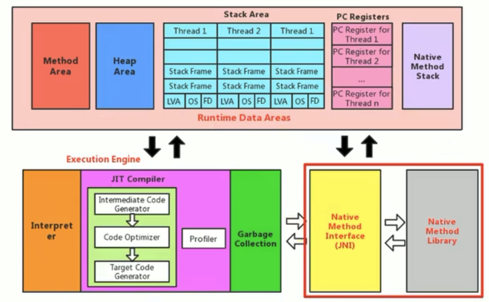

# 本地方法接口

### 本地方法

⚠️ 這段不在運行時數據區中

* **一個Native Method就是一個Java調用非Java代碼的接口**。一個Native Method是這樣一個Java方法：該方法的實現由非Java語言實現，比如C。這個特徵並非Java所特有，很多其他的編程語言都有這一機制，比如C++中，可以用extern "C"告知C++編譯器去調用一個C的函數。
* "A native method is a Java method whose implementation is provided by non-java code" 本地方法是一個非Java的方法，他的具體實現是非Java代碼的實現。
* 在定義native method時，並不提供實現體(有些像定義一個Java interface)，因為其實現體是由非Java語言在外面實現的。
* 本地接口的作用是融合不同的編程語言為Java所用，他的初衷是融合C/C++程序。

#### 舉例

參考[IHaveNatives.java](chapter06/IHaveNatives.java)，**`native`可以與其他java修飾符使用，但是`abstract`除外**。

#### 為什麼要使用Native Method？

Java使用起來非常方便，然而有些層次的任務用Java實現起來不容易，或者我們對程序的效率很在意時，問題就來了。

* **與Java環境外交互**：**有時Java應用需要與Java外面的環境交互，這是本地方法存在的主要原因**。你可以想想Java需要與一些底層系統，如操作系統或某些硬件交換信息時的情況。本地方法正是這樣一種交流機制：他為我們提供了一個非常簡潔的接口，而我們無需去了解Java應用之外的繁瑣細節。
* **與操作系統的交互**：JVM支持著Java語言本身和運行時庫，他是Java程序賴以生存的平台，他由一個解釋器(解釋字節碼)和一些連接到本地代碼的庫組成。然而不管怎樣，他畢竟不是一個完整的系統，他經常依賴於一些底層系統的支持。這些底層系統常常是強大的操作系統。**通過使用本地方法，我們得以用Java實現了jre的底層系統的交互，甚至JVM的一些部分就是用C寫的**。還有，如果我們要使用一些Java語言本身沒有提供封裝的操作系統的特徵時，我們也需要使用本地方法。
* **Sun's Java**：**Sun的解釋器是用C實現的，這使得他能像一些普通的C一樣與外部交互**。jre大部分是用Java實現的，他也通過一些本地方法與外界交互。例如類`java.lang.Thread`的`setPriority()`方法適用Java實現的，他是他實現調用的是該類裡的本地方法`setPriority0()`。這個本地方法是用C實現的，並被植入JVM內部，在Windows 95的平台上，這個本地方法最終將調用Win32 SetPriority API。這是一個本地方法的具體實現由JVM直接提供，更多的情況是本地方法由外部的動態鏈接庫(external dynamic link library)提供，然後被JVM調用。

#### 本地方法的現狀

**目前該方法使用的越來越少了，除非是與硬件有關的內容**，比如通過Java程序驅動打印機或者Java系統管理生產設備，在企業級應用中已經比較少見。因為現在的異構領域間的通信很發達，比如可以使用Socket通信，也可以使用Web Service等等。

