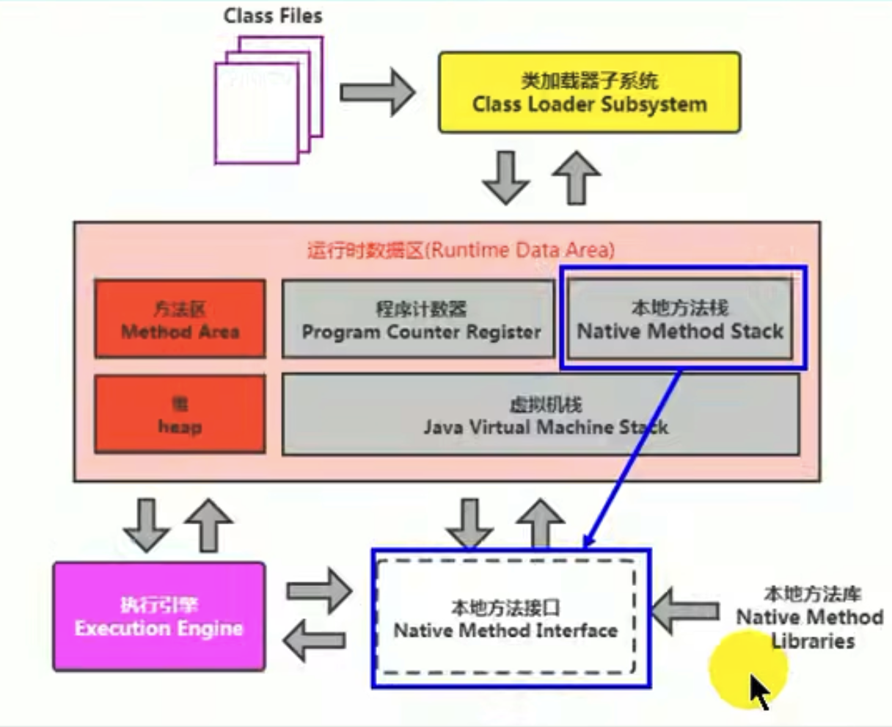

# 本地方法棧

* **Java虛擬機棧用於管理Java方法的調用，而本地方法棧用於管理本地方法的調用**。
* 本地方法棧也是線程私有的。
* 允許被實現成固定或者是可動態擴展的內存大小。(在內存溢出方面是相同的)。
  * 如果線程請求分配的棧容量超過本地方法棧允許的最大容量，Java虛擬機將會拋出一個StackOverflowError異常。
  * 如果本地方法棧可以動態擴展，並且在嘗試擴展的時候無法申請到足夠的內存，或者在創建新的線程時沒有足夠的內存去創建對應的本地方法棧，那麼Java虛擬機會拋出一個OutOfMemoryError異常。
* 本地方法是使用C語言實現的。
* 他的具體做法是Native Method Stack中登記native方法，在Execution Engine執行時加載本地方法庫。

*注意事項*：

* 當某個線程調用一個本地方法時，他就進入了一個全新的並且不再受虛擬機限制的世界。他和虛擬機擁有同樣的權限。
  * 本地方法可以通過本地方法接口來**訪問虛擬機內部的運行時數據區**。
  * 他甚至可以直接使用本地處理器中的寄存器。
  * 直接從本地內存的堆中分配任意數量的內存。
* **並不是所有的JVM都支持本地方法。因為Java虛擬機規範並沒有明確要求本地方法棧的使用語言、具體實現方式、數據結構**等。如果JVM產品不打算支持native方法，也可以無需實現本地方法棧。
* 在HotSpot JVM中，直接將本地方法棧和虛擬機棧合二為一。

